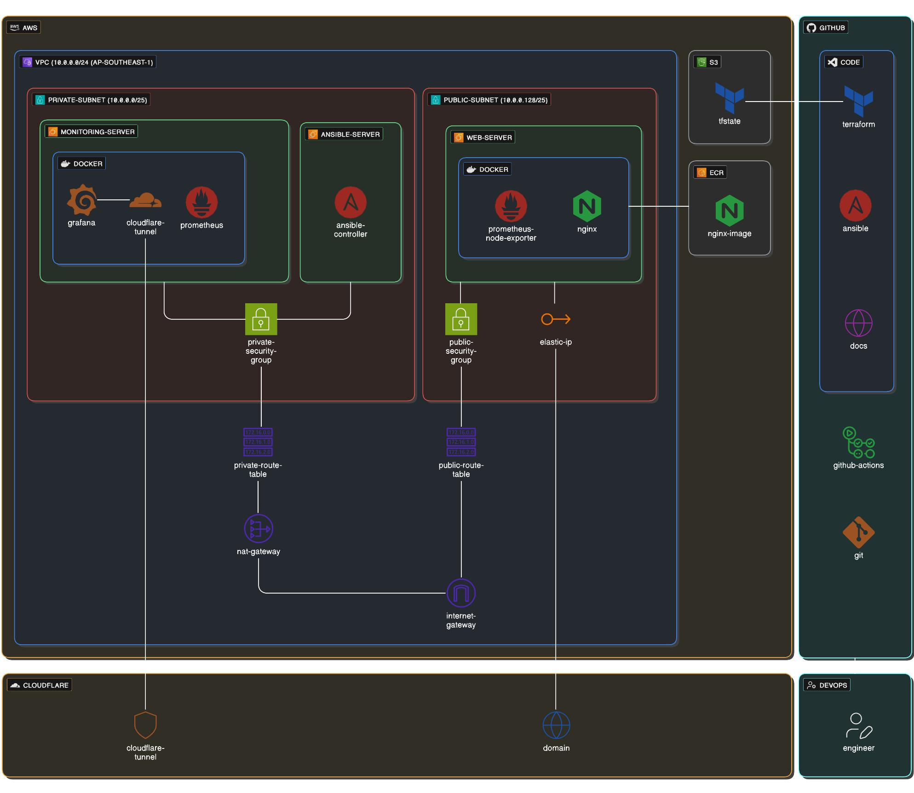

# DevOps Bootcamp Final Project

## Project Overview

This project demonstrates proficiency across the full DevOps lifecycle:

- **Infrastructure Provisioning** — Deploy AWS resources programmatically using Terraform, enabling reproducible and version-controlled infrastructure.
- **Configuration Management** — Automate server setup and application configuration using Ansible for consistency across environments.
- **Containerization and Deployment** — Build, push, and deploy containerized applications to Amazon ECR and EC2 using Docker and CI/CD automation.
- **Observability and Monitoring** — Implement comprehensive monitoring and visualization using Prometheus for metrics collection and Grafana for dashboards.
- **DevOps Practices** — Leverage automation, CI/CD pipelines, and industry best practices to streamline development and deployment workflows.
- **Technical Documentation** — Maintain clear, accessible project documentation published via GitHub Pages for knowledge sharing and project transparency.

## Project Scope and Architecture



### Infrastructure and Deployment Focus

All AWS infrastructure is provisioned declaratively using Terraform, ensuring repeatable and version-controlled deployments. Server configuration is managed entirely through Ansible playbooks, enabling consistent and idempotent infrastructure state across all environments. The project prioritizes infrastructure automation and deployment orchestration rather than application development.

### CI/CD Pipeline

The GitHub Actions workflow automates two primary tasks: publishing documentation updates and managing container image delivery. The pipeline clones the Ansible playbook repository to the Ansible controller, then builds Docker images, pushes them to Amazon ECR, and triggers deployment through SSM commands to EC2 instances running the containerized application.

## Project Requirements and Setup

### Prerequisites

The following tools and accounts are required to complete this project:

- **Visual Studio Code** — A code editor for writing Infrastructure as Code and configuration files
- **AWS Account** — An active AWS account with cloud resources and CI/CD permissions
- **GitHub Account** — A GitHub account for version control and CI/CD automation
- **Git** - Version control system installed on your local machine for cloning repositories and managing code
- **Docker** — Container runtime installed locally for building and testing Docker images
- **Ansible** — Configuration management tool installed locally for playbook development and testing
- **AWS CLI** — Command-line tool for managing AWS resources programmatically from your terminal

### Development Environment Setup

#### Install Visual Studio Code

Download Visual Studio Code from the [official website](https://code.visualstudio.com/download). Linux users can download directly from the same link.

#### Configure VS Code Extensions

Install the following extensions to enhance your Infrastructure as Code development:

- **Terraform Extension** — Provides syntax highlighting, code completion, and validation for Terraform files
- **GitHub Copilot** — Leverages AI to suggest code completions and auto-complete Infrastructure as Code blocks based on context, significantly accelerating Terraform and Ansible playbook development

#### Set Up AWS Account

Sign up for an [AWS Free Tier account](https://aws.amazon.com/free/) to receive $200 in promotional credits for learning and experimentation.

#### Initialize GitHub Repository

Create a new GitHub repository named `devops-bootcamp-final-project-kamariza` (or your preferred naming convention) to host your project code.

#### Install Git in Ubuntu

Update package manager and install Git
```
sudo apt update
sudo apt install -y git
```

Verify Git installation
```
git --version
```
#### Configure Git After Installation

After installing Git on any operating system, configure your username and email:
```
git config --global user.name "your-github-username"
git config --global user.email "your-github-email@example.com"
```
Replace ```your-github-username``` and ```your-github-email@example.com``` with your actual GitHub credentials.

Verify your configuration:
```
git config --global --list
```
This should display your username and email.

#### Clone Repository Locally

Clone the repository to your local machine using SSH:


```
git clone git@github.com:kamariza30/devops-bootcamp-final-project-kamariza.git

```
Create Project Structure
Inside the cloned repository, create the following directory structure:
```
devops-bootcamp-final-project-kamariza/
├── terraform/
├── ansible/
└── README.md
```
Open Project in VS Code
Navigate to the project directory in your terminal and open VS Code:
```
cd Documents/devops-bootcamp-final-project-kamariza/
code .
```
### Install Docker on Ubuntu

Quick Installation
For detailed step-by-step instructions, visit the official Docker documentation:
[Install Docker Engine on Ubuntu](https://docs.docker.com/engine/install/ubuntu/)

### Install terraform on Ubuntu

For complete installation instructions across all operating systems, visit the official HashiCorp documentation:
[Install Terraform](https://developer.hashicorp.com/terraform/install)

### Install Ansible

Installation Steps
Update your system packages:
```
sudo apt update && sudo apt upgrade -y
```
Install pipx (Python package manager):
```
sudo apt install pipx
```
Ensure pipx binaries are in your PATH:
```
pipx ensurepath
```
After installation, verify that Ansible is installed correctly by checking its version:
```
ansible --version
```
This command will display the installed Ansible version and Python interpreter details.

Note: You may need to log out and log back in, or open a new terminal window for the ```pipx ensurepath``` changes to take effect.

### AWS CLI Installation and Configuration

Update system packages and install dependencies:
```
sudo apt update
sudo apt install -y curl unzip
```
Download the installer package:
```
curl "https://awscli.amazonaws.com/awscli-exe-linux-x86_64.zip" -o "awscliv2.zip"
```
Unzip the installer:
```
unzip awscliv2.zip
```
Run the install script:
```
sudo ./aws/install
```
Verify the installation:
```
aws --version
```
Configure AWS CLI
After installing AWS CLI, configure it with your AWS credentials:
```
aws configure
```
This command will prompt you for:

1. AWS Access Key ID — Enter your access key
2. AWS Secret Access Key — Enter your secret key
3. Default region name — Enter your preferred AWS region
4. Default output format — Enter output format

Follow the next steps to generate the required values for AWS CLI configuration

### Creating the AWS CLI User for Terraform

#### Step 1: Navigate to IAM in AWS Console
Open the AWS [Management Console](https://console.aws.amazon.com/) and search for "IAM" to access the Identity and Access Management service.
#### Step 2: Access the Users Section
In the IAM dashboard, select Users from the left sidebar, then click Create user.
#### Step 3: Name the User
Enter ```terraform-user``` as the username for this IAM identity, then click Next.
#### Step 4: Attach Administrative Permissions
On the permissions page, select Attach policies directly and search for AdministratorAccess. Check the box next to this managed policy.
Click Next, review the configuration, then click Create user.
#### Step 5: Generate Access Keys
After the user is created:
1. Click on the terraform-user username to open the user details page
2. Select the Security credentials tab
3. Scroll to Access keys section and click Create access key
4. Select Command Line Interface (CLI) as the use case
4. Check the acknowledgment box and click Create access key
#### Step 6: Copy Your Access Keys
A modal will display your access key credentials:
- Access Key ID — Copy this value

- Secret Access Key — Copy this value

Important: Store these credentials securely. This is the only time AWS will display your secret access key. You cannot retrieve it later.

Click Download .csv file to save the credentials locally (recommended for backup).
#### Step 7: Use Credentials with AWS CLI
Once you have copied your access keys, configure AWS CLI:
```
aws configure
```
When prompted, enter:
```
AWS Access Key ID [None]: <paste your Access Key ID>
AWS Secret Access Key [None]: <paste your Secret Access Key>
Default region name [None]: ap-southeast-1
Default output format [None]: json
```
#### Step 8: Verify Configuration
Test your AWS CLI setup:
```
aws sts get-caller-identity --output table
```
If the command executes successfully and displays your account details, your AWS CLI is properly configured and authenticated. This confirms that your access keys are valid and your Terraform user has the necessary permissions.

### Create Your First Terraform File

#### Step 1: Open VS Code
Navigate to your project directory and open VS Code:
```
cd Documents/devops-bootcamp-final-project-kamariza/
code .
```
#### Step 2: Create main.tf in Terraform Folder
1. In the VS Code file explorer, navigate to the ```terraform/``` folder
2. Right-click inside the terraform/ folder and select New File
3. Name the file ```main.tf```
#### Step3: Add Terraform Configuration
Copy and paste the following code into your ```main.tf``` file and save the file (```Ctrl+s```):
```
terraform {
  required_providers {
    aws = {
      source  = "hashicorp/aws"
      version = "6.25.0"
    }
  }
}

provider "aws" {
  region  = "ap-southeast-1"
  profile = "default"
}

```
Your project structure should now look like this:
```
devops-bootcamp-final-project-kamariza/
├── terraform/
│   └── main.tf
├── ansible/
└── README.md
```
#### What this code does
This Terraform configuration block:
- Specifies the required provider (AWS)
- Sets the source to HashiCorp's official AWS provider
- Locks the AWS provider version to 6.25.0 for consistency and reproducibility
#### Step 4: Initialize Terraform
Open a terminal in VS Code (Terminal > New Terminal) and run:
```
cd terraform
terraform init
```
This command will:

- Download the AWS provider plugin (version 6.25.0)
- Create a .terraform/ directory with provider files
- Generate a .terraform.lock.hcl file to lock dependency versions

Expected output:
```
Initializing the backend...
Initializing provider plugins...
- Finding hashicorp/aws versions matching "6.25.0"...
- Installing hashicorp/aws v6.25.0...
- Installed hashicorp/aws v6.25.0 (...)

Terraform has been successfully initialized!
```
### Create Terraform Variables File

#### Step 1: Create variables.tf
In VS Code, inside the ```terraform/``` folder:

1. Right-click on the ```terraform/``` folder
2. Select New File
3. Name it ```variables.tf```
#### Step 2: Add Variable Definitions
Copy and paste the following code into ```variables.tf```:
```
variable "instance_type" {
  description = "EC2 instance type"
  type        = string
  default     = "t3.micro"
}

variable "cidr_block" {
  description = "VPC CIDR block"
  type        = string
  default     = "10.0.0.0/24"
}
```
Variable explanations:

- instance_type — Defines the EC2 instance size (t3.micro is Free Tier eligible)
- idr_block — Defines the VPC IP address range (10.0.0.0/24 provides 256 IP addresses)
#### Current Folder Structure
After creating both files, your ```terraform/``` folder structure should look like this:
```
devops-bootcamp-final-project-kamariza/
├── terraform/
│   ├── main.tf
│   └── variables.tf
├── ansible/
└── README.md
```

### Create IAM Configuration File

#### Step 1: Create iam.tf
In VS Code, inside the ```terraform/``` folder:
1. Right-click on the ```terraform/``` folder
2. Select New File
3. Name it ```iam.tf```
#### Step 2: Add IAM Resources
Copy and paste the following code into ```iam.tf```:
```
data "aws_iam_policy_document" "ec2_assume_role_policy" {
  statement {
    actions = ["sts:AssumeRole"]

    principals {
      type        = "Service"
      identifiers = ["ec2.amazonaws.com"]
    }
  }
}

resource "aws_iam_role" "ec2_ssm_role" {
  name               = "instance_role"
  path               = "/system/"
  assume_role_policy = data.aws_iam_policy_document.ec2_assume_role_policy.json
}

resource "aws_iam_role_policy_attachment" "es2_ssm_policy" {
  role       = aws_iam_role.ec2_ssm_role.name
  policy_arn = "arn:aws:iam::aws:policy/AmazonSSMManagedInstanceCore"
}

# Add ECR Pull Only policy. This allows EC2 instances to pull images from ECR.
resource "aws_iam_role_policy_attachment" "ec2_ecr_pull_policy" {
  role       = aws_iam_role.ec2_ssm_role.name
  policy_arn = "arn:aws:iam::aws:policy/AmazonEC2ContainerRegistryPullOnly"
}

resource "aws_iam_instance_profile" "ec2_profile" {
  name = "bootcamp-ec2-ssm-profile"
  role = aws_iam_role.ec2_ssm_role.name
}
```
#### Code Explanation

- **Data Block**: ```ec2_assume_role_policy```
Defines a trust policy allowing EC2 service to assume the IAM role.
- **Resource**: ```aws_iam_role```
Creates an IAM role named ```instance_role``` that EC2 instances can assume.
- **Resource**: ```aws_iam_role_policy_attachment``` (SSM Policy)
Attaches the ```AmazonSSMManagedInstanceCore``` managed policy to enable AWS Systems Manager Session Manager access for secure instance management without SSH keys.
- **Resource**: ```aws_iam_role_policy_attachment``` (ECR Policy)
Attaches the ```AmazonEC2ContainerRegistryPullOnly``` managed policy, allowing EC2 instances to pull Docker images from Amazon ECR.
- **Resource**: ```aws_iam_instance_profile```
Creates an instance profile that links the IAM role to EC2 instances, enabling the instances to assume the role and access SSM and ECR.
#### Current Folder Structure
```
devops-bootcamp-final-project-kamariza/
├── terraform/
│   ├── main.tf
│   ├── variables.tf
│   └── iam.tf
├── ansible/
└── README.md
```
#### Validate Configuration
Test your Terraform configuration:
```
terraform validate
```
You should see:
```
Success! The configuration is valid.

```
- The private key will be automatically generated and saved to ```ansible/ansible-key.pem``` when you run terraform apply
- This key file will be used later by Ansible to authenticate with EC2 instances
- The key permissions are set to ```0400``` (read-only) for security
- Never commit the ```ansible-key.pem``` file to version control — add it to ```.gitignore```

### Create .gitignore File

#### Step 1: Generate .gitignore Content
1. Go to [https://www.toptal.com/developers/gitignore/](https://www.toptal.com/developers/gitignore/)
2. In the search field, type ```terraform```
3. Click Create to generate the .gitignore file
4. Copy all the content from the generated file
#### Step 2: Create .gitignore
In VS Code, at the root of your project (not inside terraform/ folder):
1. Right-click on the project root folder in the file explorer
2. Select New File
3. Name it ```.gitignore``` (note the dot at the beginning)
#### Step 3: Paste the Content
Paste the copied content from the gitignore generator into the ```.gitignore``` file.
The file should contain entries similar to:
```
# Local .terraform directories
**/.terraform/*

# .tfstate files
*.tfstate
*.tfstate.*

# Crash log files
crash.log
crash.*.log

# Exclude all .tfvars files, which are likely to contain sensitive data
*.tfvars
*.tfvars.json

# Ignore override files, as they are usually used to override resources locally
override.tf
override.tf.json
*_override.tf
*_override.tf.json

# Include override files you do wish to add to version control using negated pattern
# !example_override.tf

# Include tfplan files to ignore the plan output of command: terraform plan -out=tfplan
*tfplan*

# Ignore CLI configuration files
.terraformrc
terraform.rc

# Ignore plan files
*.tfplan
```
4. Add entry ansible-key.pem in .gitignore
```
ansible/ansible-key.pem
```
#### Current Folder Structure
```
devops-bootcamp-final-project-kamariza/
├── .gitignore
├── terraform/
│   ├── main.tf
│   ├── variables.tf
│   ├── iam.tf
│   └── ssh.tf
├── ansible/
└── README.md
```
#### Verify .gitignore is Working
```
git add .
git commit -m "Add Terraform configuration and .gitignore"
git push origin main
```
The .gitignore file will prevent sensitive files like ```ansible-key.pem```, Terraform state files (```.tfstate```), and ```.terraform/``` directories from being committed to your repository.


### Create VPC Configuration File
#### Step 1: Create vpc.tf
In VS Code, inside the ```terraform/``` folder:
1. Right-click on the ```terraform/``` folder
2. Select New File
3. Name it ```vpc.tf```
#### Step 2: Add VPC Resources
Copy and paste my code into ```vpc.tf```:

#### Code Explanation
**VPC & Subnets:**
- **aws_vpc** — Creates a VPC with CIDR block from var.cidr_block (10.0.0.0/24)
- **aws_subnet (public)** — Creates a public subnet (10.0.0.0/25) for resources with internet access
- **aws_subnet (private)** — Creates a private subnet (10.0.0.128/25) for secure resources

**Internet Connectivity:**
- **aws_internet_gateway** — Enables internet access for the VPC
- **aws_eip** — Allocates a static Elastic IP for the NAT Gateway
- **aws_nat_gateway** — Allows private subnet resources to access the internet securely

**Routing:**
- **aws_route_table (public)** — Routes all traffic (0.0.0.0/0) through the Internet Gateway
- **aws_route_table (private)** — Routes all traffic through the NAT Gateway
- **aws_route_table_association** — Associates subnets with their respective route tables

#### Current Folder Structure
```
devops-bootcamp-final-project-kamariza/
├── .gitignore
├── terraform/
│   ├── main.tf
│   ├── variables.tf
│   ├── iam.tf
│   ├── ssh.tf
│   └── vpc.tf
├── ansible/
└── README.md
```
### Create EC2 Configuration File
#### Step 1: Create ec2.tf
In VS Code, inside the ```terraform/``` folder:
1. Right-click on the ```terraform/``` folder
2. Select New File
3. Name it ```ec2.tf```
#### Step 2: Add EC2 Resources
Copy and paste the code from my ec2.tf
#### Code Explanation
**Security Groups**

**Web Server Security Group** (```web_sg```):
- Port 80 (HTTP) — Open to the internet for web traffic
- Port 22 (SSH) — Open to VPC CIDR for secure access
- Port 9100 (Node Exporter) — Open to VPC for Prometheus metrics collection
- Egress — Allows all outbound traffic

**Ansible Controller** (```ansible_server```):
- Located in private subnet (no public IP)
- Runs user_data script to copy the ansible-key.pem

**Monitoring Server** (```monitoring_server```):
- Located in private subnet
- Hosts Prometheus and Grafana for monitoring
- Accessible only from within the VPC
#### Current Folder Structure
```
devops-bootcamp-final-project-kamariza/
├── .gitignore
├── terraform/
│   ├── main.tf
│   ├── variables.tf
│   ├── iam.tf
│   ├── ssh.tf
│   ├── vpc.tf
│   └── ec2.tf
├── ansible/
└── README.md
```
### Create S3 Configuration File
#### Step 1: Create s3.tf
In VS Code, inside the ```terraform/``` folder:
1. Right-click on the ```terraform/``` folder
2. Select New File
3. Name it ```s3.tf```

#### Step 2: Add S3 Resources
Copy and paste my code into s3.tf:

#### Code Explanation
**Resource:** ```aws_s3_bucket```
Creates an S3 bucket for storing your Terraform state file.

**Key attributes:**
- ```bucket``` — Globally unique bucket name (S3 bucket names must be unique across all AWS accounts)

- ```force_destroy = true``` — Allows Terraform to delete the bucket even if it contains objects, useful for cleanup during testing

**Resource:** ```aws_s3_bucket_versioning```
Enables versioning on the S3 bucket to maintain a history of all file versions.

**Key attributes:**
- ```status = "Enabled"``` — Keeps previous versions of objects, allowing you to recover deleted or overwritten files
#### Current Folder Structure
```
devops-bootcamp-final-project-kamariza/
├── .gitignore
├── terraform/
│   ├── main.tf
│   ├── variables.tf
│   ├── iam.tf
│   ├── ssh.tf
│   ├── vpc.tf
│   ├── ec2.tf
│   └── s3.tf
├── ansible/
└── README.md
```
After all infrastructure is provisioned, you can configure Terraform to store its state file in this S3 bucket for remote state management and team collaboration.

### Create ECR Configuration File
#### Step 1: Create ecr.tf
In VS Code, inside the ```terraform/``` folder:
1. Right-click on the ```terraform/``` folder
2. Select New File
3. Name it ```ecr.tf```
### Step 2: Add ECR Repository
Copy and paste my code into ```ecr.tf```
### Code Explanation
**Resource:** ```aws_ecr_repository```
Creates an Amazon Elastic Container Registry (ECR) repository for storing Docker images.

**Key attributes:**
- ```name``` — Repository name following the format namespace/repository-name
- ```force_delete = true``` — Allows Terraform to delete the repository even if it contains images, useful for cleanup
- ```image_scanning_configuration``` — Scans images for security vulnerabilities
- ```scan_on_push = true``` — Automatically scans images when pushed to the repository

This ECR repository will be used in your CI/CD pipeline:

1. **GitHub Actions (Build & Push)** — Builds Docker images and pushes them to this ECR repository

2. **GitHub Actions (Deploy) — Pulls** images from this ECR repository and deploys to the web server EC2 instance

### Create Output Configuration File
#### Step 1: Create output.tf
In VS Code, inside the ```terraform/``` folder:
1. Right-click on the ```terraform/``` folder
2. Select New File
3. Name it ```output.tf```
#### Step 2: Add Data Source and Outputs
Copy and paste my code into ```output.tf:```
```
# Get current AWS account information
data "aws_caller_identity" "current" {}

# Output AWS Account ID
output "account_id" {
  value = data.aws_caller_identity.current.account_id
}

# Output caller ARN
output "caller_arn" {
  value = data.aws_caller_identity.current.arn
}

# Output web server public IP
output "web_server_public_ip" {
  value = aws_instance.web_server.public_ip
}

# Output Ansible server private IP
output "ansible_server_private_ip" {
  value = aws_instance.ansible_server.private_ip
}

# Output monitoring server private IP
output "monitoring_server_private_ip" {
  value = aws_instance.monitoring_server.private_ip
}

# Output web server instance ID (for GitHub Actions secret)
output "WEB_INSTANCE_ID" {
  value = aws_instance.web_server.id
}

# Output Ansible controller instance ID (for GitHub Actions secret)
output "ANSIBLE_CONTROLLER_INSTANCE_ID" {
  value = aws_instance.ansible_server.id
}

# Output ECR registry URL (for GitHub Actions secret)
output "ECR_REGISTRY" {
  value = "${data.aws_caller_identity.current.account_id}.dkr.ecr.${var.aws_region}.amazonaws.com"
}

# Output ECR repository name (for GitHub Actions secret)
output "ECR_REPOSITORY" {
  value = aws_ecr_repository.final_project.name
}
```
#### Step 3: Add AWS Region Variable
You need to add the ```aws_region``` variable to your ```variables.tf``` file. Open ```variables.tf``` and add:
```
variable "aws_region" {
  description = "AWS region for deployment"
  type        = string
  default     = "ap-southeast-1"
}
```
### GitHub Secrets (Required for CI/CD):

- ```WEB_INSTANCE_ID``` — Instance ID of web server (for GitHub Actions deployment)
- ```ANSIBLE_CONTROLLER_INSTANCE_ID``` — Instance ID of Ansible controller
- ```ECR_REGISTRY``` — ECR registry URL format: ```ACCOUNT_ID.dkr.ecr.REGION.amazonaws.com```
- ```ECR_REPOSITORY``` — Repository path: ```devops-bootcamp/final-project-kamariza```
### Current Folder Structure
```
devops-bootcamp-final-project-kamariza/
├── .gitignore
├── terraform/
│   ├── main.tf
│   ├── variables.tf
│   ├── iam.tf
│   ├── ssh.tf
│   ├── vpc.tf
│   ├── ec2.tf
│   ├── s3.tf
│   ├── ecr.tf
│   └── output.tf
├── ansible/
└── README.md
```
### Run Terraform Plan and Apply
#### Step 1: Run Terraform Plan
In your terminal, navigate to the terraform directory and run:
```
cd terraform
terraform plan
```
This command will show you all the resources Terraform will create. Review the output to ensure everything looks correct.
#### Step 2: Run Terraform Apply
After reviewing the plan, apply the configuration:
```
terraform apply -auto-approve
```
This command will:

- Create all AWS resources (VPC, subnets, EC2 instances, security groups, IAM roles, ECR repository, S3 bucket, SSH keys)
- Display all outputs
#### Step 3: Copy the Required Outputs
After ```terraform apply``` completes successfully, you'll see output similar to this:
```
Outputs:

account_id = "123456789012"
caller_arn = "arn:aws:iam::123456789012:user/terraform-user"
web_server_public_ip = "54.123.45.67"
ansible_server_private_ip = "10.0.0.135"
monitoring_server_private_ip = "10.0.0.136"
WEB_INSTANCE_ID = "i-0abc123def456xyz"
ANSIBLE_CONTROLLER_INSTANCE_ID = "i-0xyz789abc123def"
ECR_REGISTRY = "123456789012.dkr.ecr.ap-southeast-1.amazonaws.com"
ECR_REPOSITORY = "devops-bootcamp/final-project-kamariza"
```
Copy these four values:
| Variable                        | Example Value                                      |
|---------------------------------|----------------------------------------------------|
| `WEB_INSTANCE_ID`              | `i-0abc123def456xyz`                              |
| `ANSIBLE_CONTROLLER_INSTANCE_ID` | `i-0xyz789abc123def`                            |
| `ECR_REGISTRY`                 | `123456789012.dkr.ecr.ap-southeast-1.amazonaws.com` |
| `ECR_REPOSITORY`               | `devops-bootcamp/final-project-kamariza`          |

### Add GitHub Repository Secrets
#### Step 1: Go to Your GitHub Repository
1. pen your GitHub repository: ```https://github.com/kamariza30/devops-bootcamp-final-project-kamariza```
2. Click on the Settings tab at the top of the repository
#### Step 2: Navigate to Secrets
In the left sidebar, under Security, click on Secrets and variables → Actions
#### Step 3: Create Secret for WEB_INSTANCE_ID
1. Click New repository secret
2. In the Name field, enter: ```WEB_INSTANCE_ID```
3. In the Secret field, paste your ```WEB_INSTANCE_ID``` value (e.g., i-0abc123def456xyz)
3. Click Add secret
#### Step 4: Create Secret for ANSIBLE_CONTROLLER_INSTANCE_ID
1. Click New repository secret
2. In the Name field, enter: ```ANSIBLE_CONTROLLER_INSTANCE_ID```
3. In the Secret field, paste your ANSIBLE_CONTROLLER_INSTANCE_ID value (e.g., i-0xyz789abc123def)
#### Step 5: Create Secret for ECR_REGISTRY
1. Click New repository secret
2. In the Name field, enter: ```ECR_REGISTRY```
3. In the Secret field, paste your ECR_REGISTRY value (e.g., 123456789012.dkr.ecr.ap-southeast-1.amazonaws.com)
4. Click Add secret
#### Step 6: Create Secret for ECR_REPOSITORY
1. Click New repository secret
2. In the Name field, enter: ```ECR_REPOSITORY```
3. In the Secret field, paste your ECR_REPOSITORY value (e.g., devops-bootcamp/final-project-kamariza)
4. Click Add secret

### Create GitHub Actions IAM User and Secrets
### Step 1: Create IAM User in AWS
1. Go to AWS IAM Console
2. Click on Users in the left sidebar
3. Click Create user
4. Enter username: ```github-action-user```
5. Click Next
#### Step 2: Attach Inline Policy
1. On the permissions page, select Attach policies directly
2. Click Create inline policy (or paste custom policy)
3. Choose JSON tab
4. Replace the default content with the policy below:
```
{
    "Version": "2012-10-17",
    "Statement": [
        {
            "Sid": "GetAuthorizationToken",
            "Effect": "Allow",
            "Action": [
                "ecr:GetAuthorizationToken"
            ],
            "Resource": "*"
        },
        {
            "Effect": "Allow",
            "Action": [
                "ecr:BatchGetImage",
                "ecr:BatchCheckLayerAvailability",
                "ecr:CompleteLayerUpload",
                "ecr:GetDownloadUrlForLayer",
                "ecr:InitiateLayerUpload",
                "ecr:PutImage",
                "ecr:UploadLayerPart"
            ],
            "Resource": [
                "arn:aws:ecr:ap-southeast-1:YOUR_ACCOUNT_ID:repository/devops-bootcamp/final-project-kamariza"
            ]
        },
        {
            "Sid": "SSMSendCommand",
            "Effect": "Allow",
            "Action": [
                "ssm:SendCommand",
                "ssm:GetCommandInvocation"
            ],
            "Resource": "*"
        }
    ]
}
```
5. Replace ```YOUR_ACCOUNT_ID``` with your actual AWS account ID (from the Terraform outputs)
6. Click Review policy
7. Enter policy name: github-actions-policy
8. Click Create policy
9. Click Next → Create user

#### Step 3: Generate Access Keys
1. Click on the newly created ```github-action-user``` in the Users list
2. Go to the Security credentials tab
3. Scroll to Access keys section
4. Click Create access key
5. Select Command Line Interface (CLI) as the use case
6. Check the acknowledgment box
7. Click Create access key
8. Copy and add both Access Key id and Secret Access Key to Github secret
#### Step 4: Copy Access Keys
A modal will display your credentials:
- **Access Key ID** — Copy this value
- **Secret Access Key** — Copy this value
#### Step 5: Add Secrets to GitHub Repository
1. Go to your GitHub repository
2. Click Settings → Secrets and variables → Actions
3. Click New repository secret
4. Name it AWS_ACCESS_KEY_ID and AWS_SECRET_ACCESS_KEY and paste the value respectively
### Configure Terraform S3 Backend
#### Step 1: Create backend.tf
In VS Code, inside the ```terraform/``` folder:
1. Right-click on the ```terraform/``` folder
2. Select New File
3. Name it ```backend.tf```
#### Step 2: Add Backend Configuration
Copy and paste my code to backend.tf
#### Step 3: Plan Terraform Configuration
Before migrating the state, run terraform plan:
```
cd terraform
terraform plan
```
#### Step 4: Migrate State to S3
Run the following command to migrate your local state file to S3:
```
terraform init -migrate-state
```
When prompted, confirm the migration:
```
Do you want to copy existing state to the new backend?
```
Answer: **yes**

This command will:
- Upload your local ```terraform.tfstate``` to the S3 bucket
- Configure Terraform to use S3 as the remote backend
- Create a ```.terraform/terraform.tfstate``` lock file
#### Current Folder Structure
```
devops-bootcamp-final-project-kamariza/
├── .gitignore
├── terraform/
│   ├── main.tf
│   ├── variables.tf
│   ├── iam.tf
│   ├── ssh.tf
│   ├── vpc.tf
│   ├── ec2.tf
│   ├── s3.tf
│   ├── ecr.tf
│   ├── output.tf
│   └── backend.tf
├── ansible/
└── README.md
```
#### Benefits of S3 Backened
- **Remote State** — State file stored centrally in AWS, not on your local machine
- **Team Collaboration** — Multiple team members can work on the same infrastructure
- **State Locking** — Prevents concurrent modifications using DynamoDB
- **Encryption** — State file encrypted at rest in S3
- **Versioning** — S3 versioning enabled for state file history
- **Security** — No sensitive data stored locally on your computer
#### Commit you backend configuration to Git:
```
git add terraform/backend.tf
git commit -m "Add S3 backend configuration for remote state management"
git push origin main
```